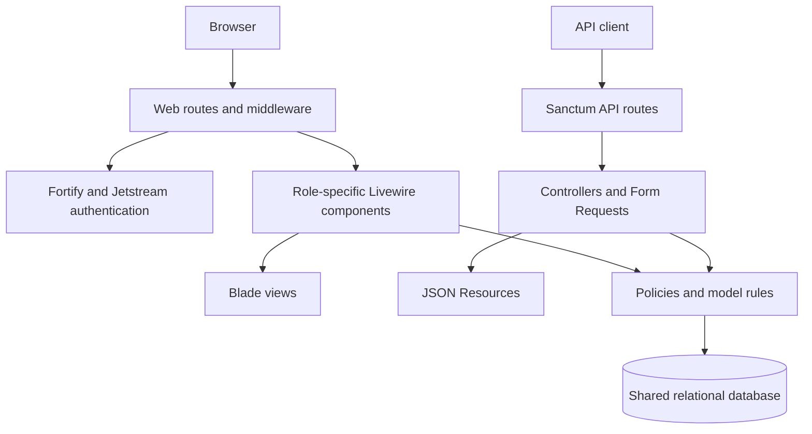
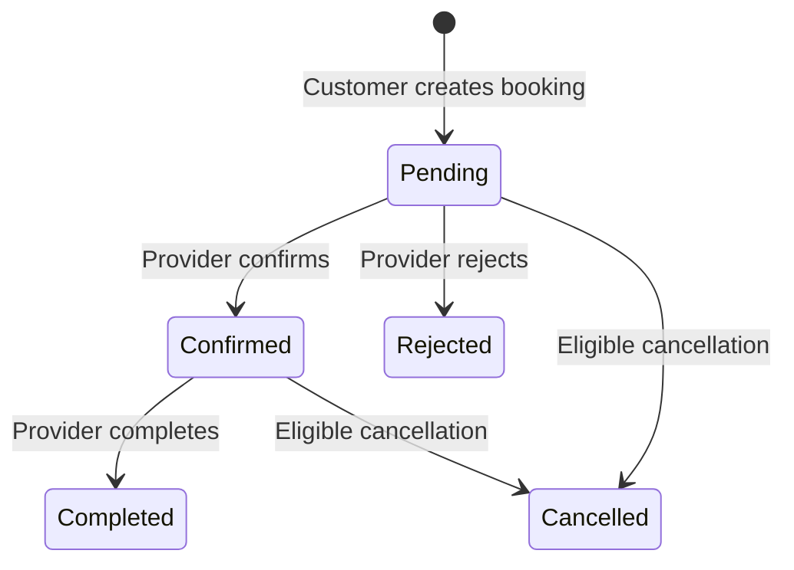

# BookEase system overview

Analysis date: 11 September 2026. This describes the working tree, including the existing email-verification view changes. Application behavior was not changed during this analysis.

## Scope and architecture

BookEase is a service marketplace and appointment-management application with customer, provider, and administrator roles. It is a Laravel monolith: the browser interface uses server-rendered Blade and Livewire, while external clients use a separate REST API. The browser booking interface does not call the REST booking controllers.

The review covered the application code, routes, migrations, factories, seeders, Blade views, frontend entry points, configuration, tests, and project documentation. Relevant installed framework code was inspected to trace authentication and Livewire behavior; third-party dependency trees were not exhaustively audited.

The repository contains 53 PHP files under `app`, 14 migrations, 65 Blade views, and 19 PHP files under `tests` (including the base test case). There are 14 application Livewire components: five customer, four provider, and five admin components.

Versions recorded in `composer.lock`: Laravel 12.64.0, Livewire 3.8.2, Jetstream 5.5.3, Fortify 1.37.2, Sanctum 4.3.2, and Laravel Passkeys 0.2.1. Composer requires PHP 8.2 or later. The frontend uses Tailwind CSS 3, Vite, Axios, and Alpine behavior supplied through Livewire. The application has very little standalone JavaScript.

## Roles and pages

| Role | Pages | Responsibility |
| --- | --- | --- |
| Guest | `/`, login, registration, password recovery | Marketing page and account access |
| Customer | `/customer/services`, service details, booking form, `/customer/bookings`, review form | Search services, select slots, create/cancel bookings, review completed appointments |
| Provider | `/provider/business`, `/provider/services`, `/provider/availability`, `/provider/bookings` | Maintain one business, its services and schedule, and manage customer bookings |
| Administrator | `/dashboard`, `/admin/users`, `/admin/businesses`, `/admin/bookings`, `/admin/activity-logs` | Monitor the platform, approve/suspend businesses, suspend/reactivate users, inspect audit activity |
| Authenticated user | Profile settings and API-token management | Manage account details, password, two-factor authentication, browser sessions, and tokens |

`/dashboard` redirects customers to their service catalogue and providers to service management. Administrators receive the dashboard view, which embeds `Admin\Dashboard` and polls every 30 seconds.

Admin user management changes account status, not roles, and excludes administrators and self-suspension. Admin booking monitoring is read-only even though `BookingPolicy` grants administrators some additional abilities.

## Data model

| Model | Relationships and purpose |
| --- | --- |
| `User` | Role and account status; owns at most one business; has customer bookings, reviews, and activity logs |
| `Business` | Belongs to a provider through `owner_id`; has services; unique owner and slug; pending/active/suspended; soft deleted |
| `Service` | Belongs to a business; has duration, price, active flag, slots, bookings, and reviews through bookings; soft deleted |
| `AvailabilitySlot` | Belongs to a service; start/end timestamps, capacity, active flag; has bookings |
| `Booking` | Links customer, service, and slot; stores a price snapshot, reference, status, notes, and cancellation details |
| `BookingStatusHistory` | Records each status change, actor, previous/new status, and reason |
| `Review` | One per booking, enforced by a unique key; customer, rating 1–5, optional comment |
| `ActivityLog` | Actor, action name, polymorphic entity reference, JSON metadata, IP address, and user agent |

Infrastructure tables support sessions, password resets, API tokens, passkeys, cache, and queues. Foreign keys restrict deletion of users referenced by businesses, bookings, or reviews. Booking service and slot references are separately stored; the database does not enforce that a booking's service matches its slot's service.

## Main business workflows

### Registration and authentication

`CreateNewUser` validates name, email, and password. The database defaults new accounts to active customers. There is no public provider registration or role-promotion workflow in the application. Provider and admin accounts are supplied by demo seeding or another manual provisioning process.

Fortify handles login, registration, password recovery, email verification, and two-factor authentication. Jetstream supplies profile and token-management components. `User` implements `MustVerifyEmail`; changing an email address clears verification and sends a new verification notification.

The current verification page is presentation around the existing Fortify routes:

- `GET /email/verify`: verification prompt.
- `POST /email/verification-notification`: resend the notification.
- `GET /email/verify/{id}/{hash}`: signed verification link.
- The page also links to profile settings and posts logout with CSRF protection.

The vendor controllers open in the IDE are package implementations. Application customization belongs in the existing application actions, providers, configuration, and published views. Rendering the verification page does not establish that real SMTP delivery succeeds; mail delivery was not exercised.

### Provider setup and availability

A provider creates one business profile with pending status. They can prepare services and availability before approval; customer visibility requires both an active service and an active business. Administrators approve pending businesses and can suspend or reactivate them independently of the owner's account status.

Services specify a duration of 15–1,440 minutes and a price. Slot creation computes the end from the chosen start plus service duration, with capacity between 1 and 100. The overlap check covers all services in the same business, including inactive slots. There is no employee/resource model: this is effectively one schedule per business, with group capacity within a slot.

Services and slots with booking records cannot be deleted through their management components. They can be deactivated. Slot editing currently permits changes to the time and service even when bookings exist; see the findings below.

### Customer booking

The catalogue searches service names/descriptions and business names, supports sorting by name, price, rating, or recency, and optionally filters to services with available slots. Service details display business information, future available appointments, and the six latest reviews.

Booking creation runs in a transaction and locks the selected slot. It rechecks service authorization, active/future availability, remaining capacity, and duplicate active customer bookings. It copies the current service price into the booking, generates a `BE-YYYYMMDD-XXXXXXXX` reference, and writes initial status history and an activity record.

Pending and confirmed bookings consume capacity. Completed, rejected, and cancelled bookings do not. Slots must start in the future to accept a new booking.

Customers can cancel their own pending/confirmed bookings only when the appointment starts more than 24 hours from now, with a reason. Providers can reject pending bookings, complete confirmed bookings, or cancel pending/confirmed bookings. The provider UI exposes rejection for pending bookings and cancellation for confirmed bookings; the API also supports cancellation of pending bookings.

Completion currently checks status and ownership, not whether the appointment has actually occurred. A completed booking can receive one customer review. Status transitions and reviews use transactions, record locks, and audit records.

### API

All application API endpoints are under `/api/v1`, require Sanctum authentication, active and verified accounts, and share a 60-request-per-minute limiter keyed by user (or IP fallback).

| Method and path after `/api/v1` | Ability | Purpose |
| --- | --- | --- |
| `GET /user` | No extra ability | Current user |
| `GET /services` | `services:read` | Search/filter/sort catalogue |
| `GET /services/{service}` | `services:read` | Service details |
| `GET /services/{service}/slots` | `services:read` | Available slots, optionally by date |
| `GET /bookings` | `bookings:read` | Customer's bookings |
| `GET /bookings/{booking}` | `bookings:read` | Customer's booking detail |
| `POST /bookings` | `bookings:create` | Create booking using `slot_id` and optional notes |
| `PATCH /bookings/{booking}/cancel` | `bookings:cancel` | Cancel with reason |
| `GET /provider/bookings` | `provider:manage-bookings` | Provider's booking list |
| `PATCH /provider/bookings/{booking}/status` | `provider:manage-bookings` | Provider status transition |

Controllers and policies also check role and ownership; selecting a provider token ability does not make a customer a provider. List endpoints paginate and cap requested page size at 50. Resources control nested JSON fields and timestamp formatting. There are no application API endpoints for provider service/slot editing, business approval, or reviews.

## Confirmed findings

These findings were reproduced using temporary PHPUnit probes with SQLite in memory, separate from the application's database.

1. **Provider list isolation can be bypassed.** `ServiceManager` and `AvailabilityManager` expose an unlocked public `businessId` and trust it when rendering lists. A provider can change that Livewire property to another business ID and read its services, including inactive services belonging to a pending business. Mutation helpers generally rederive ownership from the authenticated user; the demonstrated issue is unauthorized reading. Relevant locations: `app/Livewire/Provider/ServiceManager.php:23`, `:293`; `app/Livewire/Provider/AvailabilityManager.php:28`, `:405`.
2. **Editing a booked slot can make records inconsistent.** Changing a slot from service A to service B succeeds while an existing booking continues to reference service A. Changing its timestamps also changes the appointment time seen through existing booking relations, without a booking rescheduling workflow. Relevant location: `app/Livewire/Provider/AvailabilityManager.php:138`.
3. **Account deletion can partially execute and fail.** A provider with a business hits a foreign-key restriction when deleting the user, but their API tokens have already been deleted. The action has no encompassing transaction or domain-specific handling for retained booking/business records. Relevant location: `app/Actions/Jetstream/DeleteUser.php:13`.
4. **Suspending a provider does not stop new bookings at their active business.** Customer visibility and booking authorization check business/service activity, not owner account status. A booking against a suspended provider's active business succeeded in the API probe. This needs an explicit product rule because account and business suspension are separate controls. Relevant locations: `app/Models/Service.php:67`, `app/Policies/ServicePolicy.php:28`.
5. **Suspension is not reapplied to all Livewire requests.** An HTTP probe loaded the customer catalogue, suspended the customer, and then posted a search update using the original component snapshot to `/livewire/update`. It returned 200 with service data. Custom active/role middleware and email verification are not registered as persistent middleware; the catalogue render does not independently check account activity. This demonstrates continued catalogue access, not a bypass of every action's policy checks. Relevant locations: `app/Providers/AppServiceProvider.php`, `app/Livewire/Customer/ServiceCatalog.php`, and the installed Livewire `PersistentMiddleware` class.

## Other implementation gaps and design considerations

- **Business logic duplication:** booking creation, cancellation, transitions, reference generation, and logging are repeated across Livewire and API controllers. Shared application actions would reduce rule drift.
- **Concurrency remains partly unverified:** slot creation uses a locking overlap query, while slot editing does not explicitly lock the edited slot before counting active bookings. The in-memory tests do not establish MySQL behavior for concurrent scheduling, capacity edits, deletion, or last-place booking races.
- **Time zone:** `config/app.php` uses UTC. Forms accept local-looking date/time strings and views format stored timestamps without a business/customer time-zone conversion. Sri Lankan appointment expectations need an explicit time-zone convention.
- **History:** price is snapshotted, while service names, duration, business details, and appointment times are read through current related records. Later edits can change how historical bookings appear.
- **Rejection reasons:** rejection is logged in status history and activity metadata, but booking responses and normal booking cards expose cancellation reasons rather than rejection history.
- **Passkeys:** Fortify enables them and a migration exists, but the current user model lacks passkey integration and the published login/profile views do not expose passkey controls. Treat this as incomplete configuration rather than a verified feature.
- **Missing product features:** no payment processing, subscription billing, booking emails/reminders, custom background jobs, recurring-slot generation, calendar sync, or implemented rescheduling flow was found. A `reschedule` policy method alone does not implement rescheduling. The admin completed-value metric is a sum of booking prices, not collected payments.
- **Demo data:** the default seeder creates verified demo roles and 64 slots, including simultaneous slots across services that the provider overlap validator would reject. It uses a fixed demo password and is intended for development/demo use.
- **Documentation/scaffolding:** README installation instructions end partway through a code block; terms/privacy text remains placeholder content; the Postman globals file contains no requests; the role/status migration has an empty `down()` method. Teams and profile photos are disabled, but some published scaffolding remains.

## Validation and limits

The existing suite completed with **40 passed, 5 failed, 1 skipped, and 120 assertions**. All five failures initially stop at the missing `UserFactory::withPersonalTeam()` helper: API token creation, update and deletion, email-verification page rendering, and password-confirmation page rendering. Token tests also reference old generic abilities such as `read` and `delete` instead of BookEase's configured abilities, so removing the factory call alone will not fully align those tests.

Seven temporary probes passed across two runs (30 assertions), reproducing the five findings above, confirming that the current verification page renders for an unverified user, and checking successful rendering of all 14 role-specific pages with related sample records. The defect probes assert the observed problematic behavior; passing them does not mean those defects are fixed. The temporary probe source is in `%TEMP%/BookEaseArchitectureProbeTest.php`.

The Vite production build succeeded into a temporary directory, compiling 55 modules. The application routes booted successfully. No live mail was sent, existing application data was not migrated or seeded, and no browser visual, production deployment, dependency vulnerability, or concurrent MySQL audit was performed.

## Where to make future changes

| Change | Primary files |
| --- | --- |
| Authentication page appearance | `resources/views/auth/*.blade.php`, guest layout |
| Registration and profile behavior | `app/Actions/Fortify`, Fortify/Jetstream providers and configuration |
| Role navigation and landing behavior | `resources/views/navigation-menu.blade.php`, `routes/web.php` |
| Booking eligibility and status permissions | `app/Models/Booking.php`, `app/Policies/BookingPolicy.php`, booking Livewire components and API controllers |
| Catalogue visibility | `app/Models/Service.php`, `ServicePolicy`, customer components and API service controller |
| Provider scheduling | `app/Livewire/Provider/AvailabilityManager.php`, slot model/policy and matching Blade view |
| Admin moderation and metrics | `app/Livewire/Admin`, matching Blade views |
| API access and response shape | `routes/api.php`, Form Requests, Resources, Jetstream permissions |
| Schema and demo data | `database/migrations`, factories, seeders |

Priority order for follow-up work: repair provider list isolation and persistent authorization; protect booked-slot integrity and account deletion; clarify suspension and time-zone rules; align tests and add coverage for the custom Livewire workflows; then consolidate repeated booking logic.
